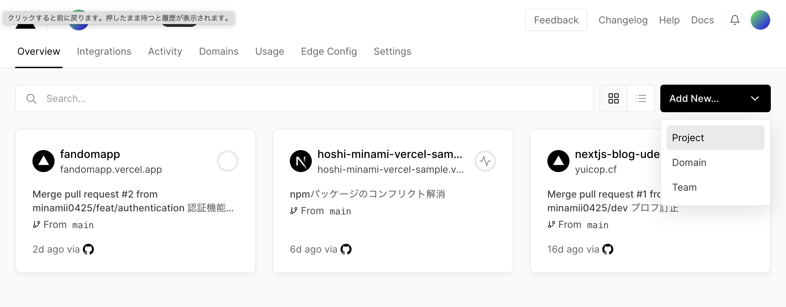
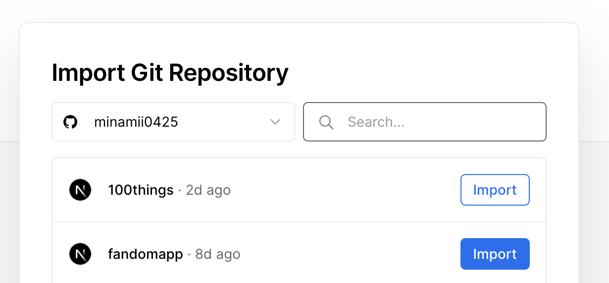
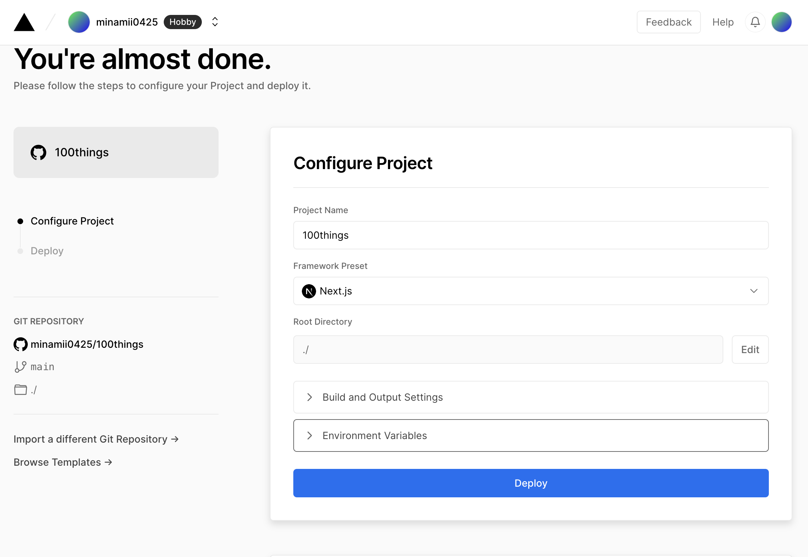
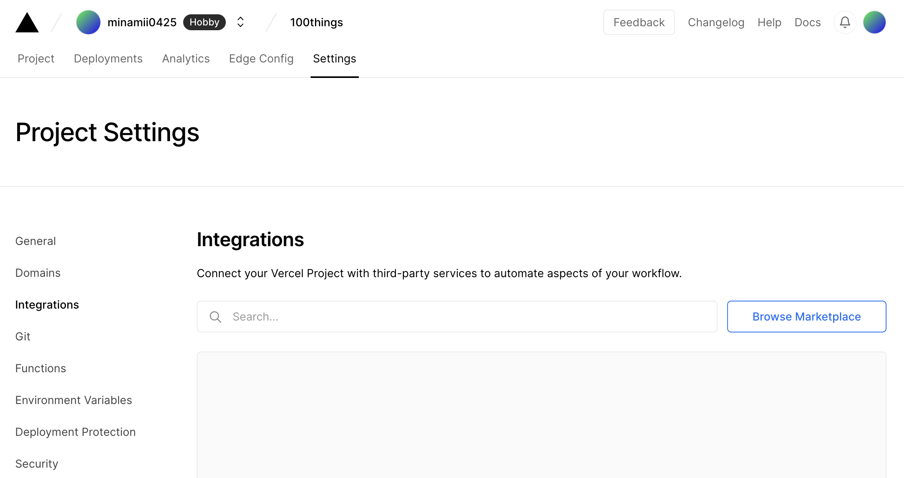
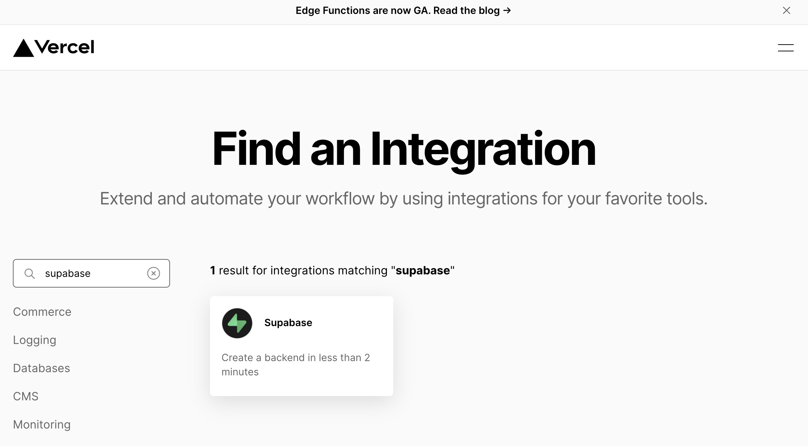
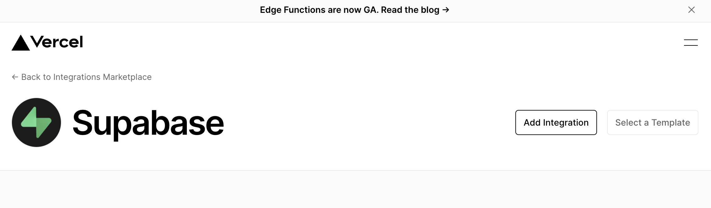
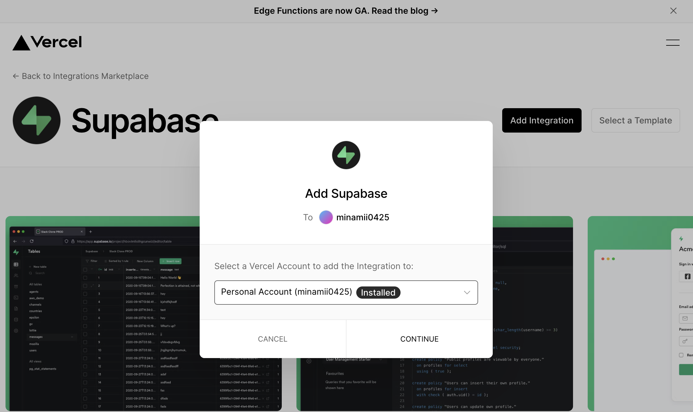
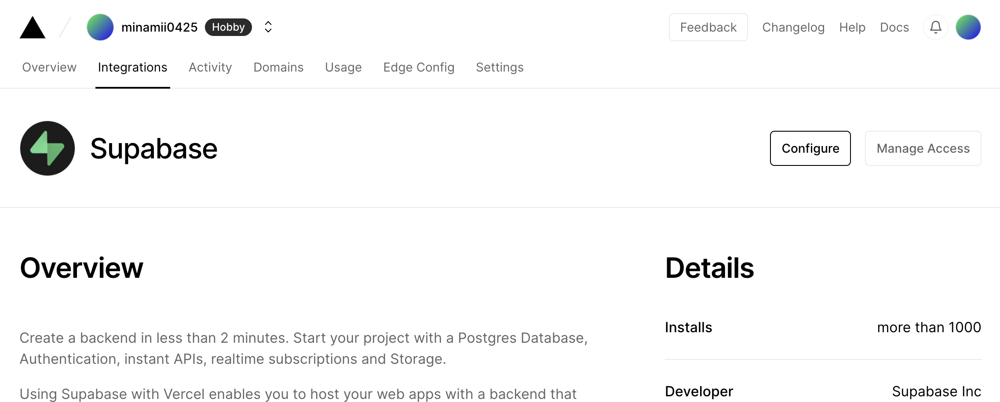
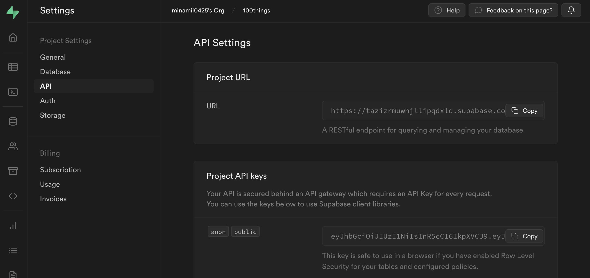

## 導入パッケージ

axios, aspida

```bash
# npm i @aspida/axios axios
```

sass

```bash
# npm i sass
```

Prisma

```bash
# npm i prisma
# npm i @prisma/client
```

Supabase

```bash
# npm i @supabase/supabase-js
```

Chakra UI

```bash
# npm i @chakra-ui/react @emotion/react @emotion/styled framer-motion
```

このバージョンじゃないと動かない

````bash
    "@chakra-ui/icons": "^2.0.13",
    "@chakra-ui/react": "^2.4.2",
    "@chakra-ui/system": "^2.3.4",
```

```bash
# npm i typescript ts-node @types/node --save-dev
````

# Aspida

```js
module.exports = {
  input: "aspida_api",
  outputEachDir: true,
  openapi: { inputFile: "./docs/openapi.yaml" },
};
```

## Prisma

```bash
# npm prisma init
```

`prisma/schema.prisma`と.`.env`が生成される

なぜか初回の`npx prisma migrate dev`コマンドが効かないので代わりに`db push`を実行する

```
# npx prisma db push
```

https://zenn.dev/yuyan0915/articles/ab936efa60947f
効果なし

```
minamii0425@minamii0425 100things % npx prisma db push
Environment variables loaded from .env
Prisma schema loaded from prisma/schema.prisma
Datasource "db": PostgreSQL database "postgres", schema "public" at "db.tazizrmuwhjllipqdxld.supabase.co:5432"
Error: P4002

The schema of the introspected database was inconsistent: Illegal cross schema reference from `public.profiles` to `auth.users` in constraint `profiles_id_fkey`. Foreign keys between database schemas are not supported in Prisma. Please follow the GitHub ticket: https://github.com/prisma/prisma/issues/1175
```

# Vercel

Add New > Project


インポートしたい Import




# Supabase

```
minamii0425@minamii0425 100things % supabase link --project-ref yfuqqvomabnonafmogsq --password 9SoRu1itu1bYLtCD
Finished supabase link.
Local config differs from linked project. Try updating supabase/config.toml
[api]
port = 54321
schemas = ["public", "storage", "graphql_public"]
extra_search_path = ["public", "extensions"]
max_rows = 1000
minamii0425@minamii0425 100things %
```

https://githubplus.com/supabase/cli/issues/243

https://github.com/prisma/prisma/issues/1175#issuecomment-1195274592

# Vercel と Supabase の連携











```bash
minamii0425@minamii0425 100things % npx vercel login
Vercel CLI 28.10.0
> Log in to Vercel github
> Success! GitHub authentication complete for minamii0425@gmail.com
Congratulations! You are now logged in. In order to deploy something, run `vercel`.
💡  Connect your Git Repositories to deploy every branch push automatically (https://vercel.link/git).
minamii0425@minamii0425 100things %
```

```bash
minamii0425@minamii0425 100things % npx vercel link
> UPDATE AVAILABLE Run `npm i -g vercel@latest` to install Vercel CLI 28.10.1
> Changelog: https://github.com/vercel/vercel/releases/tag/vercel@28.10.1
Vercel CLI 28.10.0
? Set up “~/Library/CloudStorage/Box-Box/Work/Productive/SelfEducation/frontend_edu/next/100things”? [Y/n] y
? Which scope should contain your project? minamii0425
? Found project “minamii0425/100things”. Link to it? [Y/n] y
✅  Linked to minamii0425/100things (created .vercel)
minamii0425@minamii0425 100things %
```


